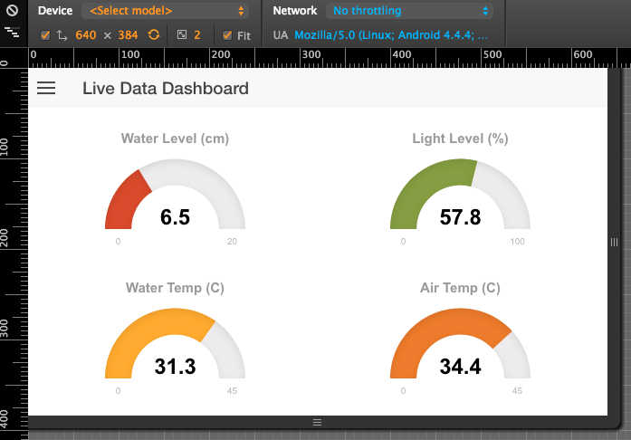
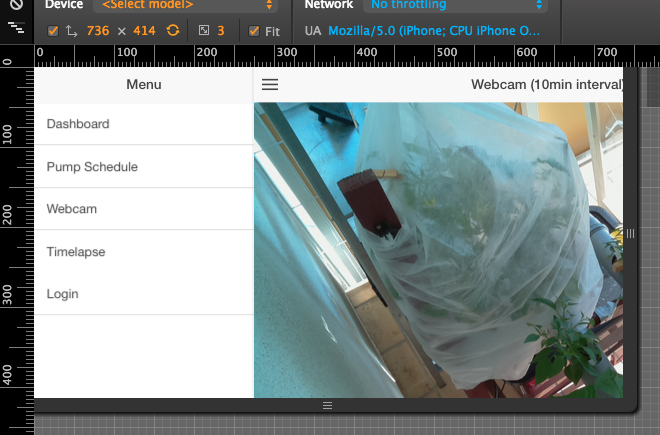

#Hydrouino Dream Garden In Your Phone
This is an experimental hybrid app based on [Ionic](http://ionicframework.com/). It's working, but it is unpolished.

## Develop

- Install Ionic
- ```ionic add ionic-service-core```
- ```ionic serve```

### Build for iOS
```ionic build ios```, then open the sub project ```platforms/ios/HelloCordova,xcodepproj``` in XCode and launch 
the app in the emulator (the ionic CLI command doesn't seem to work).

### Deploy
```ionic deploy```

**Screenshots from Chrome mobile preview**




